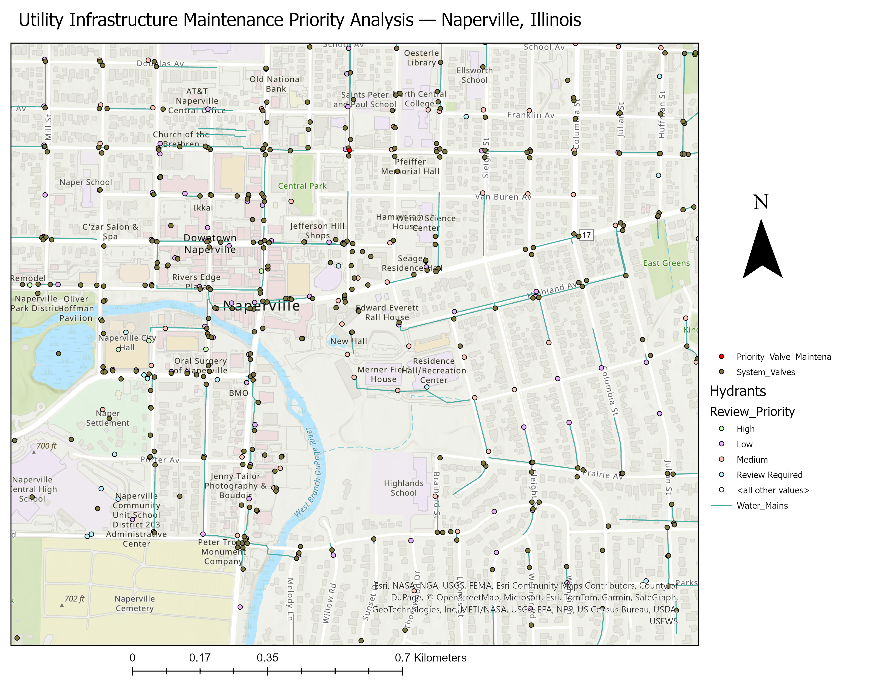

# Utility Infrastructure Maintenance Priority Analysis

A GIS-based asset management project analyzing water distribution infrastructure in Naperville, Illinois, using ArcGIS Pro, Python, and ArcPy.

## Project Objective

Analyze water utility assets to identify maintenance priorities and locate system valves near high-priority water mains for targeted infrastructure review.

## Tools & Technologies

- ArcGIS Pro
- Python
- ArcPy
- ArcGIS Online
- Spatial Analysis
- Geospatial Data QA/QC

## Dataset

The project uses Esri water distribution network demonstration data representing infrastructure in Naperville, Illinois. The analyzed assets include:

- 1,717 water mains
- 889 hydrants
- 1,642 system valves

> **Note:** This is a portfolio analysis using demonstration data. The priority classifications are analysis-derived and do not represent official City of Naperville maintenance decisions.

## Methodology

The workflow included:

1. Extracting relevant water infrastructure layers into a local geodatabase.
2. Performing QA/QC on installation dates and asset attributes.
3. Calculating asset age using Python and ArcPy.
4. Classifying assets by age and maintenance-review priority.
5. Identifying high-priority water mains, hydrants, and system valves.
6. Performing spatial proximity analysis to identify high-priority valves located near high-priority water mains.
7. Creating a focused maintenance-review dataset for priority valves.

## Key Results

- **673** high-priority water mains
- **19** high-priority hydrants
- **60** high-priority system valves
- **18** system valves identified within 100 ft of high-priority water mains

## Project Map

  

## Interactive Map

Explore the analysis through the interactive ArcGIS web map:

**[View Interactive Map](https://arcg.is/nr5fy2)**
